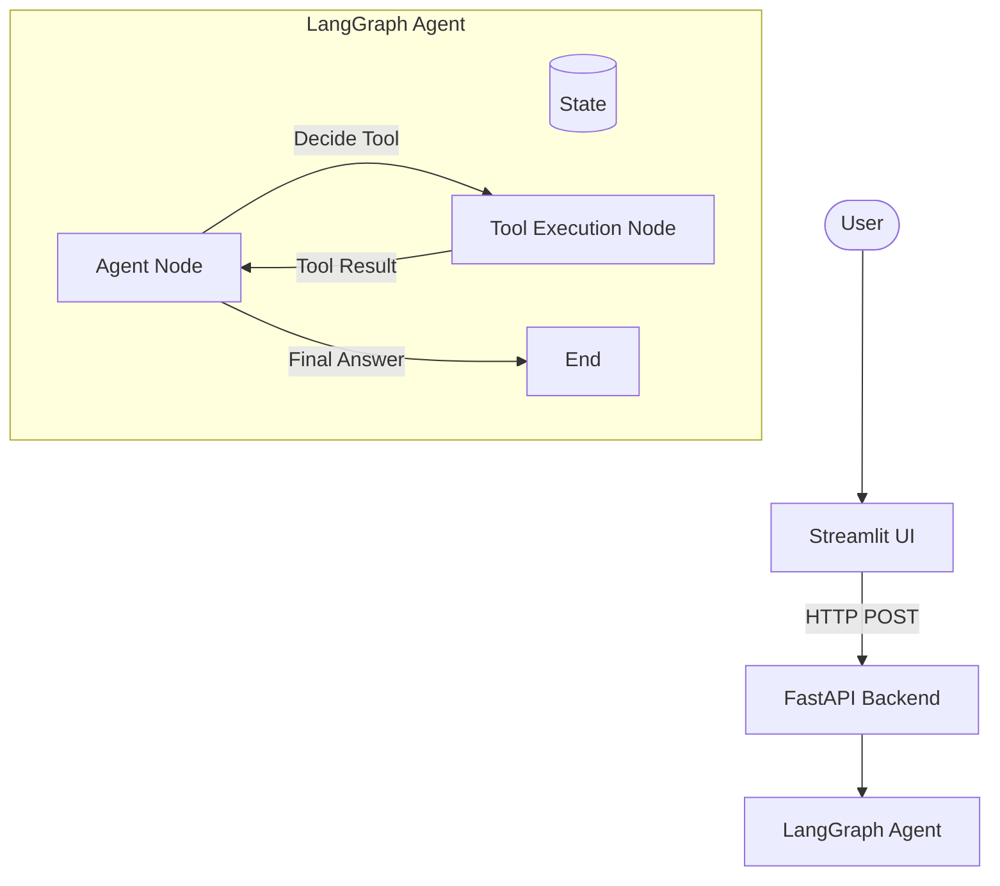

# Agentic AI Assistant 🤖

A complete, production-ready personal AI assistant built with Python, LangGraph, LangChain, FastAPI, and Streamlit. This assistant can plan multi-step tasks, execute various tools, reflect on intermediate results, and provide comprehensive answers while maintaining a conversation history.

## Features ✨

- **Multi-step Task Planning & Execution**: Utilizes LangGraph to dynamically break down tasks, decide which tools to use, and iterate until the task is complete.
- **Tool Calling**: Includes built-in tools for:
  - 🧮 Calculator (Mathematical operations)
  - 📂 Local File Reader (Read contents of specified files safely)
  - 📝 Notes / Memory Save (Save and retrieve snippets across sessions)
  - 🌐 Web Search (Integration via DuckDuckGo, easily swappable with Tavily/Google)
- **Stateful Memory**: Employs SQLite to store conversation checkpoints and short-term memory.
- **RESTful API**: Exposes core functionality via a robust FastAPI backend.
- **Interactive Chat UI**: A Streamlit interface that visualizes the agent's reasoning process, tool usage, and final answers without exposing unsafe raw chain-of-thought.
- **Developer Ready**: Includes Pytest for testing, Ruff for linting, and strict Pydantic schemas.

## Architecture 🏗️


*(See `architecture.md` for more details)*

## Tech Stack 🛠️

- **Language**: Python 3.11+
- **Agent Framework**: [LangGraph](https://python.langchain.com/v0.1/docs/langgraph/) & [LangChain](https://www.langchain.com/)
- **Backend API**: [FastAPI](https://fastapi.tiangolo.com/)
- **Frontend UI**: [Streamlit](https://streamlit.io/)
- **Database**: SQLite (via `langgraph.checkpoint.sqlite`)
- **Validation**: [Pydantic](https://docs.pydantic.dev/)

## Getting Started 🚀

### 1. Clone the repository
```bash
git clone https://github.com/yourusername/agentic-ai-assistant-langgraph.git
cd agentic-ai-assistant-langgraph
```

### 2. Set up the environment
Create a virtual environment and install the dependencies:
```bash
python -m venv venv
source venv/bin/activate  # On Windows use `venv\Scripts\activate`
pip install -r requirements.txt
```

### 3. Configure Environment Variables
Copy the `.env.example` file and add your LLM API keys:
```bash
cp .env.example .env
```
Edit `.env` to include your provider's API key (e.g., `GOOGLE_API_KEY`).

### 4. Run the Backend API
Start the FastAPI server:
```bash
uvicorn app.main:app --reload --port 8001
```
The API will be available at `http://localhost:8001`. You can check the health endpoint at `http://localhost:8001/health`.

### 5. Run the Streamlit UI
In a new terminal window, start the frontend app:
```bash
streamlit run ui/streamlit_app.py --server.port 8505
```
The UI will be accessible at `
5`.

## Examples & Usage 💡

Try asking the agent tasks like:
- *"Calculate 25 * 4, then search the web for the capital of France, and finally save a note combining the results."*
- *"Read the file at `examples/sample_tasks.md` and summarize its contents."*
- *"What is the weather like in Tokyo right now? (Web Search)"*

*(See `examples/sample_tasks.md` for more prompts).*

## Future Improvements 🚀
- Add Tavily or Google Custom Search API integration for production web search.
- Implement streaming responses for real-time token generation in the UI.
- Enhance local file tool safety boundaries and permissioning.
- Migrate to PostgreSQL for scalable production checkpointing.

## License 📄
This project is licensed under the MIT License.
