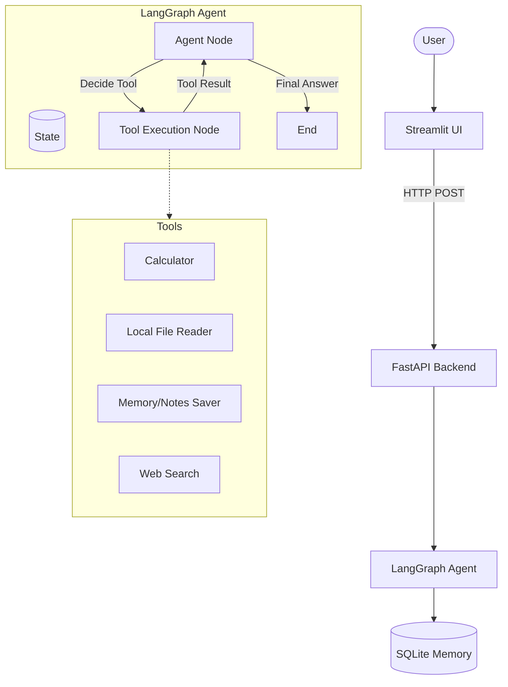

# Architecture: Agentic AI Assistant

This document outlines the architecture of the `agentic-ai-assistant-langgraph` project.

## High-Level Design

## Components

1. **Streamlit UI (`ui/streamlit_app.py`)**: A lightweight chat interface. It displays the final answer, agent plan, tool calls, and intermediate reasoning.
2. **FastAPI Backend (`app/main.py`)**: Provides endpoints (`/run-agent` and `/health`). It wraps the LangGraph workflow and ensures that chain-of-thought is safely summarized before sending it to the client.
3. **LangGraph Agent (`app/graph/workflow.py`)**: The core AI logic. It uses a state graph to iterate between planning, tool execution, and reflection until a final answer is produced.
4. **Tools (`app/tools/`)**: A collection of specific capabilities that the agent can invoke to interact with the world and gather context.
5. **Memory Store (`app/services/memory_store.py`)**: Utilizes SQLite via LangGraph's checkpointer to persist conversation history across interactions.
